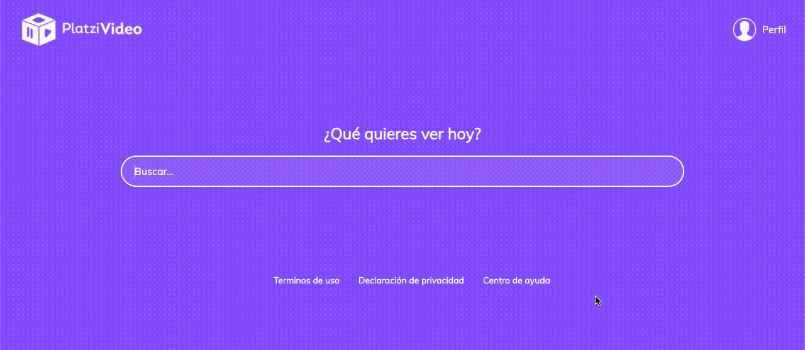

# ¡Bienvenid@s a Platzi Video!
Una aplicación desarrollada en React js para el Curso Práctico de React JS en Platzi


## La aplicación
El primer paso fué componentizar el proyecto Platzi Video (HTML y CSS).
La idea era tener componentes reutilizables, que reciban el contindo en props.
Entonces tenemos Categories (que recibe el título de la categoria y un array de objetos con el contenido a mostrar) y tenemos componentes hijos que reciben las propiedades (Carousel y CarouselItem).


```jsx
import React from 'react';
import Header from '../components/Header';
import Search from '../components/Search';
import Categories from '../components/Categories';
import Carousel from '../components/Carousel';
import CarouselItem from '../components/CarouselItem';
import Footer from '../components/Footer';
import '../assets/styles/App.scss';
import useInitialState from '../hooks/useInitialState';

const API = 'ruta-api';
const App = () => {
  const initialState = useInitialState(API);
  return initialState.length === 0 ? <h1>Sin resultados...</h1> : (
    <div className='App'>
      <Header />
      <Search />
      {initialState.mylist.length > 0 && (
        <Categories title='Mi lista'>
          <Carousel>
            <CarouselItem />
          </Carousel>
        </Categories>
      )}

      {initialState.trends.length > 0 && (
        <Categories title='Tendencias'>
          <Carousel>
            {initialState.trends.map((item) => <CarouselItem key={item.id} {...item} />)}

          </Carousel>
        </Categories>
      )}

      {initialState.originals.length > 0 && (
        <Categories title='Originales'>
          <Carousel>
            {initialState.originals.map((item) => <CarouselItem key={item.id} {...item} />)}

          </Carousel>
        </Categories>
      )}

      <Footer />
    </div>
  );
};
export default App;
```


Los arrays de objetos son definidos de antemano en useInitialState.js para evitar errores


```jsx
import { useState, useEffect } from 'react';

const useInitialState = (api) => {
  const [videos, setVideos] = useState({ mylist: [], trends: [], originals: [] });
  useEffect(() => {
    fetch(api)
      .then((response) => response.json())
      .then((data) => setVideos(data));
  }, []);
  return videos;
};
export default useInitialState;
```


## Vista sin contenido





## Conectando a fake API


## Drag Scroll para el Carousel


Para el Drag Scroll del Carousel (desplazamiento horizontal) use el proyecto [React Indiana Drag Scroll](https://github.com/Norserium/react-indiana-drag-scroll)


```jsx
import React from 'react';
import ScrollContainer from 'react-indiana-drag-scroll';
import '../assets/styles/components/Carousel.scss';

const Carousel = ({ children }) => (
  <section className='carousel'>
    <ScrollContainer>
      <div className='carousel__container'>
        {children}
      </div>
    </ScrollContainer>
  </section>
);
export default Carousel;
```

